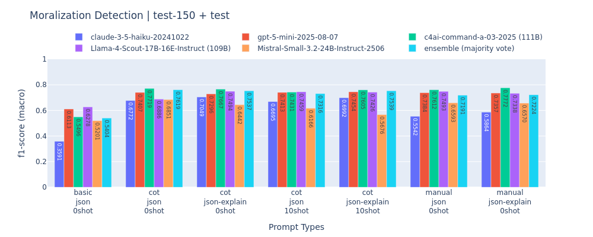
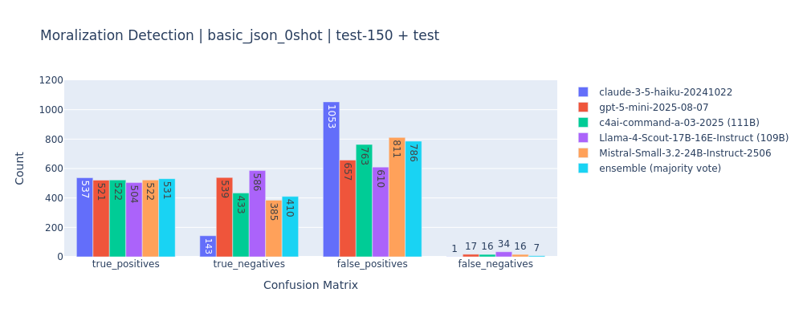
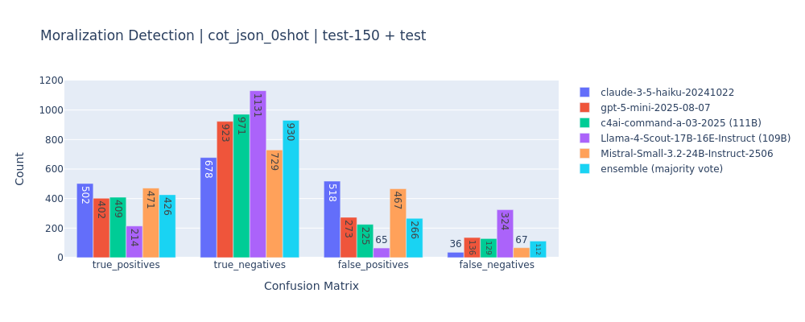
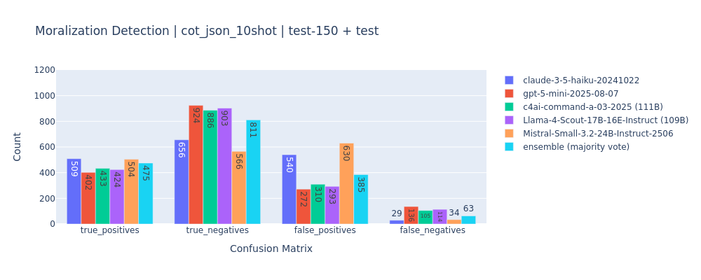
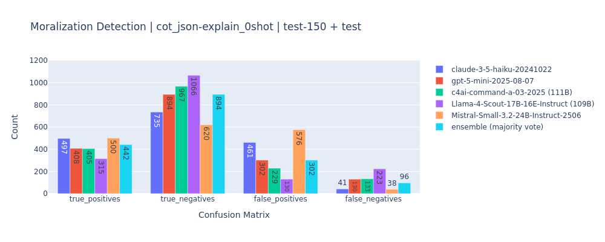
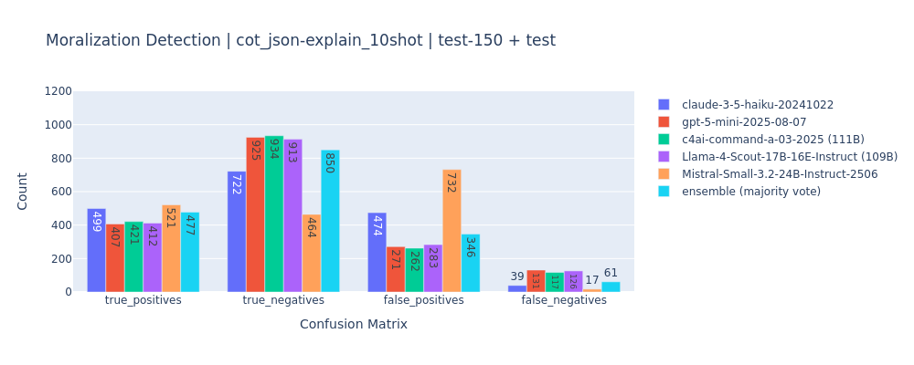
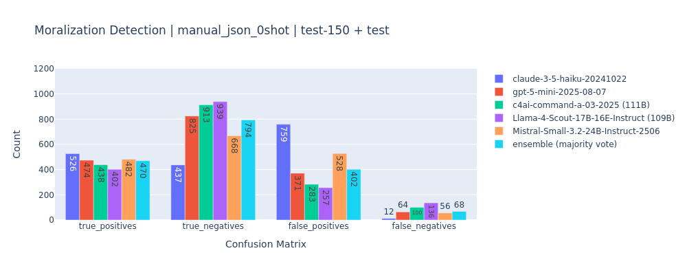

# Results

## 2025-10-18 (test-150 + test)

|claude|acc|pre|rec| f1|time[h]|
|:------|--:|--:|--:|--:|------:|
|basic_json_0shot_claude|0.3916|0.6651|0.5588|0.3586|0.00|
|cot_json_0shot_claude|0.6799|0.7204|0.7497|0.6766|0.00|
|cot_json_10shot_claude|0.6713|0.7210|0.7470|0.6689|0.00|
|cot_json-explain_0shot_claude|0.7099|0.7325|0.7688|0.7043|0.00|
|cot_json-explain_10shot_claude|0.7036|0.7303|0.7653|0.6985|0.00|
|manual_json_0shot_claude|0.5548|0.6909|0.6714|0.5536|0.00|
|manual_json-explain_0shot_claude|0.5859|0.6983|0.6924|0.5858|0.00|

|gpt-5|acc|pre|rec| f1|time[h]|
|:------|--:|--:|--:|--:|------:|
|basic_json_0shot_gpt-5|0.6107|0.7054|0.7093|0.6107|17.05|
|cot_json_0shot_gpt-5|0.7636|0.7328|0.7589|0.7400|16.73|
|cot_json_10shot_gpt-5|0.7641|0.7333|0.7593|0.7405|17.20|
|cot_json-explain_0shot_gpt-5|0.7503|0.7231|0.7524|0.7289|16.79|
|cot_json-explain_10shot_gpt-5|0.7676|0.7374|0.7644|0.7447|21.32|
|manual_json_0shot_gpt-5|0.7486|0.7439|0.7850|0.7378|18.85|
|manual_json-explain_0shot_gpt-5|0.7451|0.7434|0.7846|0.7350|20.45|

|cohere|acc|pre|rec| f1|time[h]|
|:------|--:|--:|--:|--:|------:|
|basic_json_0shot_cohere|0.5502|0.6849|0.6660|0.5490|19.50|
|cot_json_0shot_cohere|0.7953|0.7631|0.7855|0.7711|18.95|
|cot_json_10shot_cohere|0.7601|0.7377|0.7723|0.7424|19.64|
|cot_json-explain_0shot_cohere|0.7907|0.7582|0.7801|0.7660|14.28|
|cot_json-explain_10shot_cohere|0.7809|0.7518|0.7812|0.7597|12.48|
|manual_json_0shot_cohere|0.7785|0.7537|0.7883|0.7605|10.26|
|manual_json-explain_0shot_cohere|0.7976|0.7677|0.7959|0.7765|11.55|

|llama|acc|pre|rec| f1|time[h]|
|:------|--:|--:|--:|--:|------:|
|basic_json_0shot_llama|0.6280|0.6983|0.7131|0.6272|4.14|
|cot_json_0shot_llama|0.7762|0.7725|0.6721|0.6891|3.90|
|cot_json_10shot_llama|0.7647|0.7389|0.7710|0.7452|4.14|
|cot_json-explain_0shot_llama|0.7958|0.7663|0.7376|0.7486|5.48|
|cot_json-explain_10shot_llama|0.7647|0.7362|0.7654|0.7432|5.02|
|manual_json_0shot_llama|0.7739|0.7422|0.7669|0.7499|2.70|
|manual_json-explain_0shot_llama|0.7503|0.7322|0.7683|0.7343|4.62|

|mistral|acc|pre|rec| f1|time[h]|
|:------|--:|--:|--:|--:|------:|
|basic_json_0shot_mistral|0.5225|0.6755|0.6459|0.5195|5.40|
|cot_json_0shot_mistral|0.6915|0.7084|0.7421|0.6844|5.18|
|cot_json_10shot_mistral|0.6165|0.6934|0.7048|0.6160|3.59|
|cot_json-explain_0shot_mistral|0.6453|0.7030|0.7236|0.6436|4.36|
|cot_json-explain_10shot_mistral|0.5675|0.6898|0.6780|0.5670|4.32|
|manual_json_0shot_mistral|0.6626|0.6994|0.7269|0.6587|3.56|
|manual_json-explain_0shot_mistral|0.6592|0.7060|0.7311|0.6564|3.69|

|ensemble|acc|pre|rec| f1|time[h]|
|:------|--:|--:|--:|--:|------:|
|basic_json_0shot_ensemble|0.5421|0.6928|0.6647|0.5399|0.00|
|cot_json_0shot_ensemble|0.7814|0.7533|0.7842|0.7612|0.00|
|cot_json_10shot_ensemble|0.7411|0.7395|0.7801|0.7309|0.00|
|cot_json-explain_0shot_ensemble|0.7699|0.7479|0.7840|0.7530|0.00|
|cot_json-explain_10shot_ensemble|0.7647|0.7557|0.7983|0.7532|0.00|
|manual_json_0shot_ensemble|0.7284|0.7295|0.7683|0.7185|0.00|
|manual_json-explain_0shot_ensemble|0.7301|0.7370|0.7768|0.7218|0.00|

