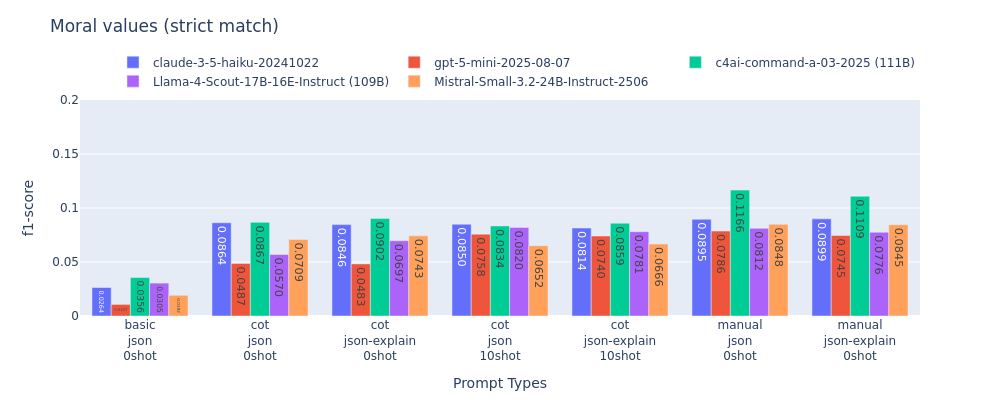
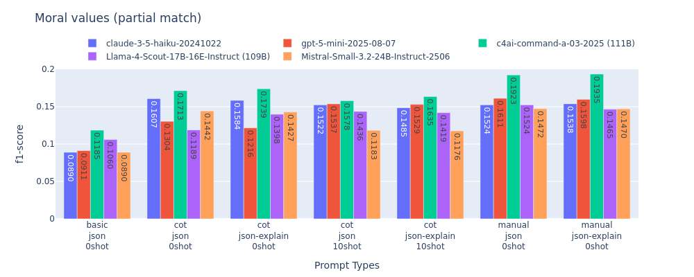
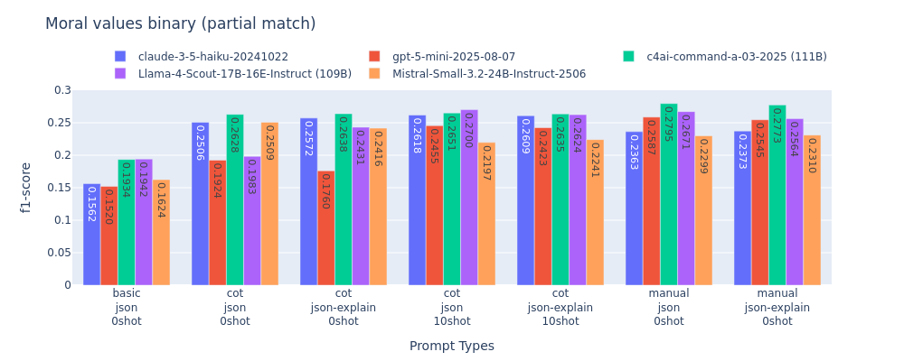

# Results

## 2025-10-18 (test-150 + test)

### with MFT categories

|claude|strategy|Correct|Incorrect|Partial|Missed|Spurious|precision|recall|f1-score|
|:-----:|:------:|---:|---:|---:|---:|---:|---:|---:|---:|
|basic_json_0shot|strict|4|28|0|116|256|0.0139|0.0270|0.0183|
|basic_json_0shot|partial|6|0|26|116|256|0.0660|0.1284|0.0872|
|cot_json_0shot|strict|11|35|0|102|186|0.0474|0.0743|0.0579|
|cot_json_0shot|partial|15|0|31|102|186|0.1315|0.2061|0.1605|
|cot_json-explain_0shot|strict|12|33|0|103|181|0.0531|0.0811|0.0642|
|cot_json-explain_0shot|partial|16|0|29|103|181|0.1350|0.2061|0.1631|
|cot_json_10shot|strict|15|46|0|87|291|0.0426|0.1014|0.0600|
|cot_json_10shot|partial|17|0|44|87|291|0.1108|0.2635|0.1560|
|cot_json-explain_10shot|strict|14|48|0|86|297|0.0390|0.0946|0.0552|
|cot_json-explain_10shot|partial|17|0|45|86|297|0.1100|0.2669|0.1558|
|manual_json_0shot|strict|16|45|0|87|263|0.0494|0.1081|0.0678|
|manual_json_0shot|partial|17|0|44|87|263|0.1204|0.2635|0.1653|
|manual_json-explain_0shot|strict|20|40|0|88|256|0.0633|0.1351|0.0862|
|manual_json-explain_0shot|partial|21|0|39|88|256|0.1282|0.2736|0.1746|

|gpt-5|strategy|Correct|Incorrect|Partial|Missed|Spurious|precision|recall|f1-score|
|:-----:|:------:|---:|---:|---:|---:|---:|---:|---:|---:|
|basic_json_0shot|strict|3|33|0|112|233|0.0112|0.0203|0.0144|
|basic_json_0shot|partial|5|0|31|112|233|0.0762|0.1385|0.0983|
|cot_json_0shot|strict|7|25|0|116|74|0.0660|0.0473|0.0551|
|cot_json_0shot|partial|8|0|24|116|74|0.1887|0.1351|0.1575|
|cot_json-explain_0shot|strict|3|24|0|121|86|0.0265|0.0203|0.0230|
|cot_json-explain_0shot|partial|5|0|22|121|86|0.1416|0.1081|0.1226|
|cot_json_10shot|strict|12|38|0|98|152|0.0594|0.0811|0.0686|
|cot_json_10shot|partial|14|0|36|98|152|0.1584|0.2162|0.1829|
|cot_json-explain_10shot|strict|6|34|0|108|122|0.0370|0.0405|0.0387|
|cot_json-explain_10shot|partial|9|0|31|108|122|0.1512|0.1655|0.1581|
|manual_json_0shot|strict|18|38|0|92|209|0.0679|0.1216|0.0872|
|manual_json_0shot|partial|20|0|36|92|209|0.1434|0.2568|0.1840|
|manual_json-explain_0shot|strict|20|34|0|94|242|0.0676|0.1351|0.0901|
|manual_json-explain_0shot|partial|24|0|30|94|242|0.1318|0.2635|0.1757|

|llama|strategy|Correct|Incorrect|Partial|Missed|Spurious|precision|recall|f1-score|
|:-----:|:------:|---:|---:|---:|---:|---:|---:|---:|---:|
|basic_json_0shot|strict|7|39|0|102|239|0.0246|0.0473|0.0323|
|basic_json_0shot|partial|12|0|34|102|239|0.1018|0.1959|0.1339|
|cot_json_0shot|strict|5|28|0|115|90|0.0407|0.0338|0.0369|
|cot_json_0shot|partial|6|0|27|115|90|0.1585|0.1318|0.1439|
|cot_json-explain_0shot|strict|8|36|0|104|136|0.0444|0.0541|0.0488|
|cot_json-explain_0shot|partial|9|0|35|104|136|0.1472|0.1791|0.1616|
|cot_json_10shot|strict|12|50|0|86|284|0.0347|0.0811|0.0486|
|cot_json_10shot|partial|16|0|46|86|284|0.1127|0.2635|0.1579|
|cot_json-explain_10shot|strict|11|47|0|90|288|0.0318|0.0743|0.0445|
|cot_json-explain_10shot|partial|14|0|44|90|288|0.1040|0.2432|0.1457|
|manual_json_0shot|strict|7|37|0|104|233|0.0253|0.0473|0.0329|
|manual_json_0shot|partial|10|0|34|104|233|0.0975|0.1824|0.1271|
|manual_json-explain_0shot|strict|15|38|0|95|235|0.0521|0.1014|0.0688|
|manual_json-explain_0shot|partial|17|0|36|95|235|0.1215|0.2365|0.1606|

|cohere|strategy|Correct|Incorrect|Partial|Missed|Spurious|precision|recall|f1-score|
|:-----:|:------:|---:|---:|---:|---:|---:|---:|---:|---:|
|basic_json_0shot|strict|7|43|0|98|257|0.0228|0.0473|0.0308|
|basic_json_0shot|partial|9|0|41|98|257|0.0961|0.1993|0.1297|
|cot_json_0shot|strict|11|36|0|101|141|0.0585|0.0743|0.0655|
|cot_json_0shot|partial|12|0|35|101|141|0.1569|0.1993|0.1756|
|cot_json-explain_0shot|strict|12|34|0|102|134|0.0667|0.0811|0.0732|
|cot_json-explain_0shot|partial|13|0|33|102|134|0.1639|0.1993|0.1799|
|cot_json_10shot|strict|13|37|0|98|193|0.0535|0.0878|0.0665|
|cot_json_10shot|partial|15|0|35|98|193|0.1337|0.2196|0.1662|
|cot_json-explain_10shot|strict|12|37|0|99|160|0.0574|0.0811|0.0672|
|cot_json-explain_10shot|partial|13|0|36|99|160|0.1483|0.2095|0.1737|
|manual_json_0shot|strict|15|26|0|107|111|0.0987|0.1014|0.1000|
|manual_json_0shot|partial|15|0|26|107|111|0.1842|0.1892|0.1867|
|manual_json-explain_0shot|strict|16|26|0|106|98|0.1143|0.1081|0.1111|
|manual_json-explain_0shot|partial|16|0|26|106|98|0.2071|0.1959|0.2014|

|mistral|strategy|Correct|Incorrect|Partial|Missed|Spurious|precision|recall|f1-score|
|:-----:|:------:|---:|---:|---:|---:|---:|---:|---:|---:|
|basic_json_0shot|strict|5|43|0|100|358|0.0123|0.0338|0.0181|
|basic_json_0shot|partial|6|0|42|100|358|0.0665|0.1824|0.0975|
|cot_json_0shot|strict|11|43|0|94|240|0.0374|0.0743|0.0498|
|cot_json_0shot|partial|16|0|38|94|240|0.1190|0.2365|0.1584|
|cot_json-explain_0shot|strict|14|39|0|95|224|0.0505|0.0946|0.0659|
|cot_json-explain_0shot|partial|17|0|36|95|224|0.1264|0.2365|0.1647|
|cot_json_10shot|strict|18|53|0|77|452|0.0344|0.1216|0.0537|
|cot_json_10shot|partial|21|0|50|77|452|0.0880|0.3108|0.1371|
|cot_json-explain_10shot|strict|17|46|0|85|446|0.0334|0.1149|0.0518|
|cot_json-explain_10shot|partial|20|0|43|85|446|0.0815|0.2804|0.1263|
|manual_json_0shot|strict|22|36|0|90|243|0.0731|0.1486|0.0980|
|manual_json_0shot|partial|22|0|36|90|243|0.1329|0.2703|0.1782|
|manual_json-explain_0shot|strict|22|39|0|87|258|0.0690|0.1486|0.0942|
|manual_json-explain_0shot|partial|23|0|38|87|258|0.1317|0.2838|0.1799|

### vice / virtue only

|claude|strategy|Correct|Incorrect|Partial|Missed|Spurious|precision|recall|f1-score|
|:-----:|:------:|---:|---:|---:|---:|---:|---:|---:|---:|
|basic_json_0shot|strict|4|30|0|100|151|0.0216|0.0299|0.0251|
|basic_json_0shot|partial|6|0|28|100|151|0.1081|0.1493|0.1254|
|cot_json_0shot|strict|11|45|0|78|135|0.0576|0.0821|0.0677|
|cot_json_0shot|partial|17|0|39|78|135|0.1911|0.2724|0.2246|
|cot_json-explain_0shot|strict|14|43|0|77|123|0.0778|0.1045|0.0892|
|cot_json-explain_0shot|partial|19|0|38|77|123|0.2111|0.2836|0.2420|
|cot_json_10shot|strict|20|55|0|59|169|0.0820|0.1493|0.1058|
|cot_json_10shot|partial|25|0|50|59|169|0.2049|0.3731|0.2646|
|cot_json-explain_10shot|strict|19|56|0|59|164|0.0795|0.1418|0.1019|
|cot_json-explain_10shot|partial|24|0|51|59|164|0.2071|0.3694|0.2654|
|manual_json_0shot|strict|22|62|0|50|210|0.0748|0.1642|0.1028|
|manual_json_0shot|partial|26|0|58|50|210|0.1871|0.4104|0.2570|
|manual_json-explain_0shot|strict|24|53|0|57|203|0.0857|0.1791|0.1159|
|manual_json-explain_0shot|partial|28|0|49|57|203|0.1875|0.3918|0.2536|

|gpt-5|strategy|Correct|Incorrect|Partial|Missed|Spurious|precision|recall|f1-score|
|:-----:|:------:|---:|---:|---:|---:|---:|---:|---:|---:|
|basic_json_0shot|strict|3|37|0|94|136|0.0170|0.0224|0.0194|
|basic_json_0shot|partial|5|0|35|94|136|0.1278|0.1679|0.1452|
|cot_json_0shot|strict|8|29|0|97|46|0.0964|0.0597|0.0737|
|cot_json_0shot|partial|9|0|28|97|46|0.2771|0.1716|0.2120|
|cot_json-explain_0shot|strict|5|28|0|101|52|0.0588|0.0373|0.0457|
|cot_json-explain_0shot|partial|7|0|26|101|52|0.2353|0.1493|0.1826|
|cot_json_10shot|strict|12|42|0|80|80|0.0896|0.0896|0.0896|
|cot_json_10shot|partial|14|0|40|80|80|0.2537|0.2537|0.2537|
|cot_json-explain_10shot|strict|7|38|0|89|68|0.0619|0.0522|0.0567|
|cot_json-explain_10shot|partial|9|0|36|89|68|0.2389|0.2015|0.2186|
|manual_json_0shot|strict|27|51|0|56|156|0.1154|0.2015|0.1467|
|manual_json_0shot|partial|31|0|47|56|156|0.2329|0.4067|0.2962|
|manual_json-explain_0shot|strict|26|50|0|58|189|0.0981|0.1940|0.1303|
|manual_json-explain_0shot|partial|31|0|45|58|189|0.2019|0.3993|0.2682|

|llama|strategy|Correct|Incorrect|Partial|Missed|Spurious|precision|recall|f1-score|
|:-----:|:------:|---:|---:|---:|---:|---:|---:|---:|---:|
|basic_json_0shot|strict|8|44|0|82|129|0.0442|0.0597|0.0508|
|basic_json_0shot|partial|12|0|40|82|129|0.1768|0.2388|0.2032|
|cot_json_0shot|strict|6|36|0|92|50|0.0652|0.0448|0.0531|
|cot_json_0shot|partial|7|0|35|92|50|0.2663|0.1828|0.2168|
|cot_json-explain_0shot|strict|10|50|0|74|77|0.0730|0.0746|0.0738|
|cot_json-explain_0shot|partial|12|0|48|74|77|0.2628|0.2687|0.2657|
|cot_json_10shot|strict|15|56|0|63|139|0.0714|0.1119|0.0872|
|cot_json_10shot|partial|20|0|51|63|139|0.2167|0.3396|0.2645|
|cot_json-explain_10shot|strict|15|52|0|67|133|0.0750|0.1119|0.0898|
|cot_json-explain_10shot|partial|18|0|49|67|133|0.2125|0.3172|0.2545|
|manual_json_0shot|strict|14|53|0|67|134|0.0697|0.1045|0.0836|
|manual_json_0shot|partial|18|0|49|67|134|0.2114|0.3172|0.2537|
|manual_json-explain_0shot|strict|16|53|0|65|142|0.0758|0.1194|0.0928|
|manual_json-explain_0shot|partial|19|0|50|65|142|0.2085|0.3284|0.2551|

|cohere|strategy|Correct|Incorrect|Partial|Missed|Spurious|precision|recall|f1-score|
|:-----:|:------:|---:|---:|---:|---:|---:|---:|---:|---:|
|basic_json_0shot|strict|7|51|0|76|159|0.0323|0.0522|0.0399|
|basic_json_0shot|partial|10|0|48|76|159|0.1567|0.2537|0.1937|
|cot_json_0shot|strict|17|46|0|71|87|0.1133|0.1269|0.1197|
|cot_json_0shot|partial|19|0|44|71|87|0.2733|0.3060|0.2887|
|cot_json-explain_0shot|strict|16|44|0|74|83|0.1119|0.1194|0.1155|
|cot_json-explain_0shot|partial|17|0|43|74|83|0.2692|0.2873|0.2780|
|cot_json_10shot|strict|16|49|0|69|111|0.0909|0.1194|0.1032|
|cot_json_10shot|partial|19|0|46|69|111|0.2386|0.3134|0.2710|
|cot_json-explain_10shot|strict|14|50|0|70|86|0.0933|0.1045|0.0986|
|cot_json-explain_10shot|partial|16|0|48|70|86|0.2667|0.2985|0.2817|
|manual_json_0shot|strict|18|42|0|74|92|0.1184|0.1343|0.1259|
|manual_json_0shot|partial|18|0|42|74|92|0.2566|0.2910|0.2727|
|manual_json-explain_0shot|strict|19|39|0|76|82|0.1357|0.1418|0.1387|
|manual_json-explain_0shot|partial|19|0|39|76|82|0.2750|0.2873|0.2810|

|mistral|strategy|Correct|Incorrect|Partial|Missed|Spurious|precision|recall|f1-score|
|:-----:|:------:|---:|---:|---:|---:|---:|---:|---:|---:|
|basic_json_0shot|strict|5|60|0|69|227|0.0171|0.0373|0.0235|
|basic_json_0shot|partial|7|0|58|69|227|0.1233|0.2687|0.1690|
|cot_json_0shot|strict|13|61|0|60|164|0.0546|0.0970|0.0699|
|cot_json_0shot|partial|20|0|54|60|164|0.1975|0.3507|0.2527|
|cot_json-explain_0shot|strict|20|56|0|58|161|0.0844|0.1493|0.1078|
|cot_json-explain_0shot|partial|25|0|51|58|161|0.2131|0.3769|0.2722|
|cot_json_10shot|strict|21|64|0|49|264|0.0602|0.1567|0.0870|
|cot_json_10shot|partial|26|0|59|49|264|0.1590|0.4142|0.2298|
|cot_json-explain_10shot|strict|20|58|0|56|251|0.0608|0.1493|0.0864|
|cot_json-explain_10shot|partial|25|0|53|56|251|0.1565|0.3843|0.2225|
|manual_json_0shot|strict|30|56|0|48|215|0.0997|0.2239|0.1379|
|manual_json_0shot|partial|31|0|55|48|215|0.1944|0.4366|0.2690|
|manual_json-explain_0shot|strict|30|58|0|46|231|0.0940|0.2239|0.1325|
|manual_json-explain_0shot|partial|32|0|56|46|231|0.1881|0.4478|0.2649|