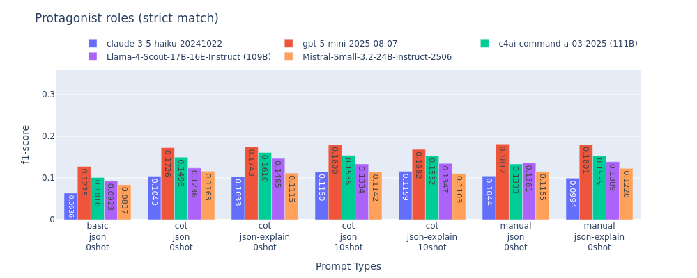
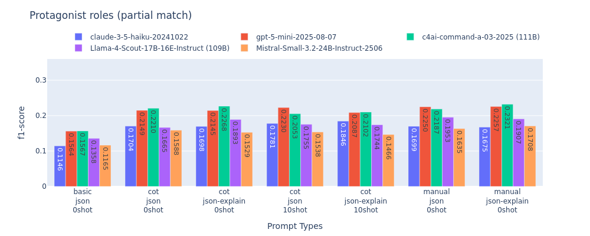
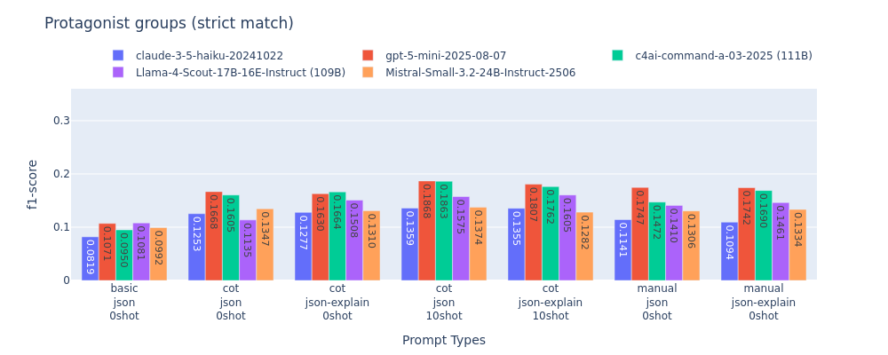
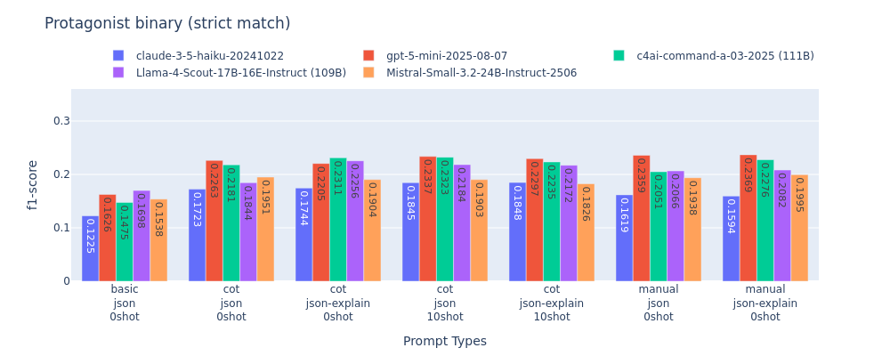
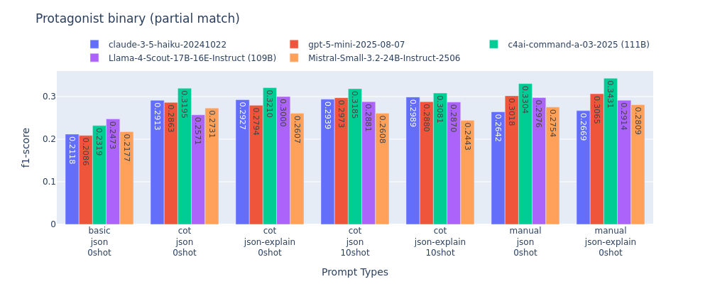

# Results

## 2025-10-18 (test-150 + test)

### role

|claude|strategy|Correct|Incorrect|Partial|Missed|Spurious|precision|recall|f1-score|
|:-----:|:------:|---:|---:|---:|---:|---:|---:|---:|---:|
|basic_json_0shot|strict|228|223|0|826|5438|0.0387|0.1785|0.0636|
|basic_json_0shot|partial|369|0|81|813|5432|0.0696|0.3242|0.1146|
|cot_json_0shot|strict|283|220|0|774|3647|0.0682|0.2216|0.1043|
|cot_json_0shot|partial|419|0|83|761|3640|0.1112|0.3646|0.1704|
|cot_json-explain_0shot|strict|271|212|0|794|3488|0.0682|0.2122|0.1033|
|cot_json-explain_0shot|partial|406|0|76|781|3486|0.1119|0.3515|0.1698|
|cot_json_10shot|strict|308|208|0|761|3562|0.0755|0.2412|0.1150|
|cot_json_10shot|partial|436|0|78|749|3558|0.1167|0.3761|0.1781|
|cot_json-explain_10shot|strict|303|219|0|755|3430|0.0767|0.2373|0.1159|
|cot_json-explain_10shot|partial|441|0|80|742|3427|0.1218|0.3808|0.1846|
|manual_json_0shot|strict|311|239|0|727|4129|0.0665|0.2435|0.1044|
|manual_json_0shot|partial|459|0|90|714|4122|0.1079|0.3990|0.1699|
|manual_json-explain_0shot|strict|302|250|0|725|4247|0.0629|0.2365|0.0994|
|manual_json-explain_0shot|partial|464|0|87|712|4244|0.1058|0.4018|0.1675|

|gpt-5|strategy|Correct|Incorrect|Partial|Missed|Spurious|precision|recall|f1-score|
|:-----:|:------:|---:|---:|---:|---:|---:|---:|---:|---:|
|basic_json_0shot|strict|488|155|0|634|5736|0.0765|0.3821|0.1275|
|basic_json_0shot|partial|551|0|89|623|5712|0.0938|0.4715|0.1564|
|cot_json_0shot|strict|345|115|0|817|2260|0.1268|0.2702|0.1726|
|cot_json_0shot|partial|396|0|62|805|2253|0.1575|0.3381|0.2149|
|cot_json-explain_0shot|strict|361|115|0|801|2389|0.1260|0.2827|0.1743|
|cot_json-explain_0shot|partial|410|0|63|790|2381|0.1547|0.3496|0.2145|
|cot_json_10shot|strict|361|112|0|804|2261|0.1320|0.2827|0.1800|
|cot_json_10shot|partial|418|0|54|791|2256|0.1631|0.3523|0.2230|
|cot_json-explain_10shot|strict|342|108|0|827|2339|0.1226|0.2678|0.1682|
|cot_json-explain_10shot|partial|396|0|52|815|2333|0.1517|0.3341|0.2087|
|manual_json_0shot|strict|400|138|0|739|2601|0.1274|0.3132|0.1812|
|manual_json_0shot|partial|455|0|78|730|2596|0.1579|0.3911|0.2250|
|manual_json-explain_0shot|strict|411|143|0|723|2734|0.1250|0.3218|0.1801|
|manual_json-explain_0shot|partial|475|0|75|713|2728|0.1563|0.4058|0.2257|

|llama|strategy|Correct|Incorrect|Partial|Missed|Spurious|precision|recall|f1-score|
|:-----:|:------:|---:|---:|---:|---:|---:|---:|---:|---:|
|basic_json_0shot|strict|265|160|0|852|4041|0.0593|0.2075|0.0923|
|basic_json_0shot|partial|351|0|73|839|4022|0.0872|0.3068|0.1358|
|cot_json_0shot|strict|156|68|0|1053|1023|0.1251|0.1222|0.1236|
|cot_json_0shot|partial|193|0|31|1039|1017|0.1680|0.1651|0.1665|
|cot_json-explain_0shot|strict|231|88|0|958|1557|0.1231|0.1809|0.1465|
|cot_json-explain_0shot|partial|274|0|44|945|1547|0.1587|0.2344|0.1893|
|cot_json_10shot|strict|277|115|0|885|2485|0.0963|0.2169|0.1334|
|cot_json_10shot|partial|334|0|56|873|2472|0.1265|0.2866|0.1755|
|cot_json-explain_10shot|strict|272|105|0|900|2384|0.0985|0.2130|0.1347|
|cot_json-explain_10shot|partial|325|0|49|889|2372|0.1273|0.2767|0.1744|
|manual_json_0shot|strict|270|152|0|855|2270|0.1003|0.2114|0.1361|
|manual_json_0shot|partial|350|0|70|843|2260|0.1437|0.3048|0.1953|
|manual_json-explain_0shot|strict|290|137|0|850|2473|0.1000|0.2271|0.1389|
|manual_json-explain_0shot|partial|364|0|63|836|2457|0.1371|0.3131|0.1907|

|cohere|strategy|Correct|Incorrect|Partial|Missed|Spurious|precision|recall|f1-score|
|:-----:|:------:|---:|---:|---:|---:|---:|---:|---:|---:|
|basic_json_0shot|strict|345|236|0|696|4975|0.0621|0.2702|0.1010|
|basic_json_0shot|partial|486|0|92|685|4950|0.0962|0.4212|0.1567|
|cot_json_0shot|strict|283|169|0|825|2055|0.1129|0.2216|0.1496|
|cot_json_0shot|partial|380|0|71|812|2047|0.1663|0.3290|0.2210|
|cot_json-explain_0shot|strict|309|164|0|804|2089|0.1206|0.2420|0.1610|
|cot_json-explain_0shot|partial|393|0|79|791|2079|0.1695|0.3424|0.2268|
|cot_json_10shot|strict|310|134|0|833|2315|0.1124|0.2428|0.1536|
|cot_json_10shot|partial|381|0|62|820|2308|0.1498|0.3262|0.2053|
|cot_json-explain_10shot|strict|292|139|0|846|2104|0.1152|0.2287|0.1532|
|cot_json-explain_10shot|partial|366|0|64|833|2094|0.1577|0.3151|0.2102|
|manual_json_0shot|strict|264|206|0|807|2213|0.0984|0.2067|0.1333|
|manual_json_0shot|partial|392|0|76|795|2202|0.1610|0.3405|0.2187|
|manual_json-explain_0shot|strict|290|184|0|803|2027|0.1160|0.2271|0.1535|
|manual_json-explain_0shot|partial|398|0|75|790|2016|0.1750|0.3448|0.2321|

|mistral|strategy|Correct|Incorrect|Partial|Missed|Spurious|precision|recall|f1-score|
|:-----:|:------:|---:|---:|---:|---:|---:|---:|---:|---:|
|basic_json_0shot|strict|329|163|0|785|6097|0.0499|0.2576|0.0837|
|basic_json_0shot|partial|422|0|68|773|6077|0.0694|0.3610|0.1165|
|cot_json_0shot|strict|349|172|0|756|4206|0.0738|0.2733|0.1163|
|cot_json_0shot|partial|429|0|90|744|4187|0.1007|0.3753|0.1588|
|cot_json-explain_0shot|strict|352|173|0|752|4511|0.0699|0.2756|0.1115|
|cot_json-explain_0shot|partial|436|0|88|739|4493|0.0957|0.3800|0.1529|
|cot_json_10shot|strict|365|165|0|747|4587|0.0713|0.2858|0.1142|
|cot_json_10shot|partial|449|0|80|734|4568|0.0959|0.3872|0.1538|
|cot_json-explain_10shot|strict|366|162|0|749|4833|0.0683|0.2866|0.1103|
|cot_json-explain_10shot|partial|440|0|86|737|4800|0.0907|0.3824|0.1466|
|manual_json_0shot|strict|293|161|0|823|3342|0.0772|0.2294|0.1155|
|manual_json_0shot|partial|373|0|78|812|3325|0.1091|0.3262|0.1635|
|manual_json-explain_0shot|strict|319|167|0|791|3433|0.0814|0.2498|0.1228|
|manual_json-explain_0shot|partial|400|0|81|782|3413|0.1131|0.3488|0.1708|

### group

|claude|strategy|Correct|Incorrect|Partial|Missed|Spurious|precision|recall|f1-score|
|:-----:|:------:|---:|---:|---:|---:|---:|---:|---:|---:|
|basic_json_0shot|strict|262|477|0|469|4449|0.0505|0.2169|0.0819|
|basic_json_0shot|partial|609|0|129|456|4443|0.1300|0.5641|0.2113|
|cot_json_0shot|strict|267|415|0|526|2371|0.0875|0.2210|0.1253|
|cot_json_0shot|partial|554|0|127|513|2367|0.2026|0.5172|0.2911|
|cot_json-explain_0shot|strict|263|395|0|550|2252|0.0904|0.2177|0.1277|
|cot_json-explain_0shot|partial|543|0|114|537|2251|0.2063|0.5025|0.2925|
|cot_json_10shot|strict|297|403|0|508|2462|0.0939|0.2459|0.1359|
|cot_json_10shot|partial|580|0|118|496|2459|0.2024|0.5352|0.2937|
|cot_json-explain_10shot|strict|294|411|0|503|2427|0.0939|0.2434|0.1355|
|cot_json-explain_10shot|partial|588|0|116|490|2425|0.2065|0.5410|0.2989|
|manual_json_0shot|strict|278|424|0|506|2961|0.0759|0.2301|0.1141|
|manual_json_0shot|partial|580|0|121|493|2956|0.1751|0.5364|0.2641|
|manual_json-explain_0shot|strict|267|444|0|497|2963|0.0727|0.2210|0.1094|
|manual_json-explain_0shot|partial|589|0|120|485|2962|0.1768|0.5436|0.2668|

|gpt-5|strategy|Correct|Incorrect|Partial|Missed|Spurious|precision|recall|f1-score|
|:-----:|:------:|---:|---:|---:|---:|---:|---:|---:|---:|
|basic_json_0shot|strict|420|465|0|323|5751|0.0633|0.3477|0.1071|
|basic_json_0shot|partial|746|0|134|314|5730|0.1230|0.6809|0.2084|
|cot_json_0shot|strict|337|284|0|587|2211|0.1190|0.2790|0.1668|
|cot_json_0shot|partial|533|0|83|578|2205|0.2037|0.4812|0.2862|
|cot_json-explain_0shot|strict|341|292|0|575|2344|0.1145|0.2823|0.1630|
|cot_json-explain_0shot|partial|534|0|94|566|2337|0.1960|0.4866|0.2794|
|cot_json_10shot|strict|375|262|0|571|2169|0.1336|0.3104|0.1868|
|cot_json_10shot|partial|553|0|81|560|2165|0.2120|0.4971|0.2973|
|cot_json-explain_10shot|strict|366|256|0|586|2222|0.1287|0.3030|0.1807|
|cot_json-explain_10shot|partial|542|0|75|577|2215|0.2046|0.4853|0.2879|
|manual_json_0shot|strict|362|315|0|531|2259|0.1233|0.2997|0.1747|
|manual_json_0shot|partial|570|0|101|523|2257|0.2119|0.5197|0.3011|
|manual_json-explain_0shot|strict|372|333|0|503|2357|0.1215|0.3079|0.1742|
|manual_json-explain_0shot|partial|599|0|101|494|2350|0.2130|0.5440|0.3061|

|llama|strategy|Correct|Incorrect|Partial|Missed|Spurious|precision|recall|f1-score|
|:-----:|:------:|---:|---:|---:|---:|---:|---:|---:|---:|
|basic_json_0shot|strict|272|407|0|529|3147|0.0711|0.2252|0.1081|
|basic_json_0shot|partial|559|0|118|517|3133|0.1622|0.5176|0.2470|
|cot_json_0shot|strict|127|187|0|894|715|0.1234|0.1051|0.1135|
|cot_json_0shot|partial|258|0|54|882|710|0.2789|0.2387|0.2572|
|cot_json-explain_0shot|strict|210|245|0|753|1123|0.1331|0.1738|0.1508|
|cot_json-explain_0shot|partial|377|0|74|743|1117|0.2640|0.3467|0.2998|
|cot_json_10shot|strict|280|277|0|651|1791|0.1193|0.2318|0.1575|
|cot_json_10shot|partial|463|0|90|641|1783|0.2175|0.4255|0.2878|
|cot_json-explain_10shot|strict|278|262|0|668|1717|0.1232|0.2301|0.1605|
|cot_json-explain_10shot|partial|451|0|84|659|1708|0.2198|0.4129|0.2869|
|manual_json_0shot|strict|230|299|0|679|1526|0.1119|0.1904|0.1410|
|manual_json_0shot|partial|437|0|89|668|1520|0.2353|0.4033|0.2972|
|manual_json-explain_0shot|strict|250|289|0|669|1675|0.1129|0.2070|0.1461|
|manual_json-explain_0shot|partial|451|0|86|657|1662|0.2246|0.4137|0.2912|

|cohere|strategy|Correct|Incorrect|Partial|Missed|Spurious|precision|recall|f1-score|
|:-----:|:------:|---:|---:|---:|---:|---:|---:|---:|---:|
|basic_json_0shot|strict|323|529|0|356|4740|0.0578|0.2674|0.0950|
|basic_json_0shot|partial|719|0|129|346|4723|0.1406|0.6562|0.2316|
|cot_json_0shot|strict|285|326|0|597|1733|0.1216|0.2359|0.1605|
|cot_json_0shot|partial|517|0|92|585|1724|0.2413|0.4715|0.3193|
|cot_json-explain_0shot|strict|299|329|0|580|1758|0.1253|0.2475|0.1664|
|cot_json-explain_0shot|partial|522|0|101|571|1752|0.2411|0.4795|0.3208|
|cot_json_10shot|strict|338|283|0|587|1799|0.1397|0.2798|0.1863|
|cot_json_10shot|partial|529|0|90|575|1794|0.2379|0.4807|0.3183|
|cot_json-explain_10shot|strict|303|271|0|634|1657|0.1358|0.2508|0.1762|
|cot_json-explain_10shot|partial|479|0|94|621|1649|0.2367|0.4405|0.3080|
|manual_json_0shot|strict|265|380|0|563|1748|0.1107|0.2194|0.1472|
|manual_json_0shot|partial|537|0|106|551|1736|0.2480|0.4941|0.3303|
|manual_json-explain_0shot|strict|289|346|0|573|1578|0.1306|0.2392|0.1690|
|manual_json-explain_0shot|partial|531|0|102|561|1568|0.2644|0.4874|0.3429|

|mistral|strategy|Correct|Incorrect|Partial|Missed|Spurious|precision|recall|f1-score|
|:-----:|:------:|---:|---:|---:|---:|---:|---:|---:|---:|
|basic_json_0shot|strict|336|471|0|401|4762|0.0603|0.2781|0.0992|
|basic_json_0shot|partial|666|0|137|391|4751|0.1322|0.6152|0.2177|
|cot_json_0shot|strict|331|400|0|477|2976|0.0893|0.2740|0.1347|
|cot_json_0shot|partial|603|0|124|467|2964|0.1802|0.5570|0.2723|
|cot_json-explain_0shot|strict|338|391|0|479|3222|0.0855|0.2798|0.1310|
|cot_json-explain_0shot|partial|609|0|117|468|3211|0.1695|0.5590|0.2602|
|cot_json_10shot|strict|373|393|0|442|3454|0.0884|0.3088|0.1374|
|cot_json_10shot|partial|639|0|125|430|3440|0.1669|0.5875|0.2599|
|cot_json-explain_10shot|strict|361|383|0|464|3682|0.0816|0.2988|0.1282|
|cot_json-explain_10shot|partial|623|0|118|453|3661|0.1549|0.5712|0.2437|
|manual_json_0shot|strict|273|353|0|582|2347|0.0918|0.2260|0.1306|
|manual_json_0shot|partial|518|0|105|571|2331|0.1931|0.4778|0.2751|
|manual_json-explain_0shot|strict|283|367|0|558|2384|0.0933|0.2343|0.1334|
|manual_json-explain_0shot|partial|537|0|108|549|2371|0.1960|0.4950|0.2808|

### binary

|claude|strategy|Correct|Incorrect|Partial|Missed|Spurious|precision|recall|f1-score|
|:-----:|:------:|---:|---:|---:|---:|---:|---:|---:|---:|
|basic_json_0shot|strict|392|349|0|465|4453|0.0755|0.3250|0.1225|
|basic_json_0shot|partial|611|0|129|452|4447|0.1302|0.5667|0.2118|
|cot_json_0shot|strict|367|315|0|524|2371|0.1202|0.3043|0.1723|
|cot_json_0shot|partial|554|0|127|511|2367|0.2026|0.5180|0.2913|
|cot_json-explain_0shot|strict|359|299|0|548|2252|0.1234|0.2977|0.1744|
|cot_json-explain_0shot|partial|543|0|114|535|2251|0.2063|0.5034|0.2927|
|cot_json_10shot|strict|403|297|0|506|2462|0.1275|0.3342|0.1845|
|cot_json_10shot|partial|580|0|118|494|2459|0.2024|0.5361|0.2939|
|cot_json-explain_10shot|strict|401|304|0|501|2428|0.1280|0.3325|0.1848|
|cot_json-explain_10shot|partial|588|0|116|488|2426|0.2064|0.5419|0.2989|
|manual_json_0shot|strict|394|308|0|504|2960|0.1076|0.3267|0.1619|
|manual_json_0shot|partial|580|0|121|491|2955|0.1752|0.5373|0.2642|
|manual_json-explain_0shot|strict|389|322|0|495|2963|0.1059|0.3226|0.1594|
|manual_json-explain_0shot|partial|589|0|120|483|2962|0.1768|0.5445|0.2669|

|gpt-5|strategy|Correct|Incorrect|Partial|Missed|Spurious|precision|recall|f1-score|
|:-----:|:------:|---:|---:|---:|---:|---:|---:|---:|---:|
|basic_json_0shot|strict|637|248|0|321|5742|0.0961|0.5282|0.1626|
|basic_json_0shot|partial|746|0|134|312|5723|0.1231|0.6820|0.2086|
|cot_json_0shot|strict|457|164|0|585|2211|0.1614|0.3789|0.2263|
|cot_json_0shot|partial|533|0|83|576|2205|0.2037|0.4820|0.2863|
|cot_json-explain_0shot|strict|461|171|0|574|2343|0.1550|0.3823|0.2205|
|cot_json-explain_0shot|partial|534|0|93|565|2336|0.1959|0.4870|0.2794|
|cot_json_10shot|strict|469|168|0|569|2171|0.1670|0.3889|0.2337|
|cot_json_10shot|partial|553|0|81|558|2167|0.2119|0.4979|0.2973|
|cot_json-explain_10shot|strict|465|157|0|584|2221|0.1636|0.3856|0.2297|
|cot_json-explain_10shot|partial|542|0|75|575|2215|0.2046|0.4862|0.2880|
|manual_json_0shot|strict|488|189|0|529|2254|0.1665|0.4046|0.2359|
|manual_json_0shot|partial|571|0|100|521|2252|0.2125|0.5210|0.3018|
|manual_json-explain_0shot|strict|505|200|0|501|2353|0.1651|0.4187|0.2369|
|manual_json-explain_0shot|partial|599|0|101|492|2346|0.2132|0.5449|0.3065|

|llama|strategy|Correct|Incorrect|Partial|Missed|Spurious|precision|recall|f1-score|
|:-----:|:------:|---:|---:|---:|---:|---:|---:|---:|---:|
|basic_json_0shot|strict|427|252|0|527|3143|0.1117|0.3541|0.1698|
|basic_json_0shot|partial|559|0|118|515|3129|0.1624|0.5185|0.2473|
|cot_json_0shot|strict|206|108|0|892|714|0.2004|0.1708|0.1844|
|cot_json_0shot|partial|257|0|55|880|709|0.2786|0.2387|0.2571|
|cot_json-explain_0shot|strict|314|141|0|751|1123|0.1990|0.2604|0.2256|
|cot_json-explain_0shot|partial|377|0|74|741|1117|0.2640|0.3473|0.3000|
|cot_json_10shot|strict|388|169|0|649|1790|0.1653|0.3217|0.2184|
|cot_json_10shot|partial|463|0|90|639|1782|0.2176|0.4262|0.2881|
|cot_json-explain_10shot|strict|376|164|0|666|1716|0.1667|0.3118|0.2172|
|cot_json-explain_10shot|partial|451|0|84|657|1708|0.2198|0.4136|0.2870|
|manual_json_0shot|strict|337|192|0|677|1527|0.1639|0.2794|0.2066|
|manual_json_0shot|partial|438|0|88|666|1521|0.2355|0.4044|0.2976|
|manual_json-explain_0shot|strict|356|183|0|667|1674|0.1609|0.2952|0.2082|
|manual_json-explain_0shot|partial|451|0|86|655|1661|0.2247|0.4144|0.2914|

|cohere|strategy|Correct|Incorrect|Partial|Missed|Spurious|precision|recall|f1-score|
|:-----:|:------:|---:|---:|---:|---:|---:|---:|---:|---:|
|basic_json_0shot|strict|501|351|0|354|4734|0.0897|0.4154|0.1475|
|basic_json_0shot|partial|719|0|129|344|4717|0.1408|0.6573|0.2319|
|cot_json_0shot|strict|387|224|0|595|1732|0.1652|0.3209|0.2181|
|cot_json_0shot|partial|517|0|92|583|1723|0.2414|0.4723|0.3195|
|cot_json-explain_0shot|strict|415|213|0|578|1758|0.1739|0.3441|0.2311|
|cot_json-explain_0shot|partial|522|0|101|569|1752|0.2411|0.4803|0.3210|
|cot_json_10shot|strict|421|200|0|585|1798|0.1740|0.3491|0.2323|
|cot_json_10shot|partial|529|0|90|573|1793|0.2380|0.4815|0.3185|
|cot_json-explain_10shot|strict|384|190|0|632|1657|0.1721|0.3184|0.2235|
|cot_json-explain_10shot|partial|479|0|94|619|1649|0.2367|0.4413|0.3081|
|manual_json_0shot|strict|369|276|0|561|1748|0.1542|0.3060|0.2051|
|manual_json_0shot|partial|537|0|106|549|1736|0.2480|0.4950|0.3304|
|manual_json-explain_0shot|strict|389|246|0|571|1578|0.1758|0.3226|0.2276|
|manual_json-explain_0shot|partial|531|0|102|559|1568|0.2644|0.4883|0.3431|

|mistral|strategy|Correct|Incorrect|Partial|Missed|Spurious|precision|recall|f1-score|
|:-----:|:------:|---:|---:|---:|---:|---:|---:|---:|---:|
|basic_json_0shot|strict|521|286|0|399|4760|0.0936|0.4320|0.1538|
|basic_json_0shot|partial|665|0|138|389|4749|0.1322|0.6158|0.2177|
|cot_json_0shot|strict|479|252|0|475|2974|0.1293|0.3972|0.1951|
|cot_json_0shot|partial|606|0|121|465|2962|0.1807|0.5591|0.2731|
|cot_json-explain_0shot|strict|491|238|0|477|3222|0.1243|0.4071|0.1904|
|cot_json-explain_0shot|partial|611|0|115|466|3211|0.1698|0.5608|0.2607|
|cot_json_10shot|strict|516|250|0|440|3450|0.1224|0.4279|0.1903|
|cot_json_10shot|partial|642|0|122|428|3436|0.1674|0.5898|0.2608|
|cot_json-explain_10shot|strict|514|230|0|462|3680|0.1162|0.4262|0.1826|
|cot_json-explain_10shot|partial|625|0|116|451|3659|0.1552|0.5730|0.2443|
|manual_json_0shot|strict|405|222|0|579|2347|0.1362|0.3358|0.1938|
|manual_json_0shot|partial|518|0|106|568|2331|0.1932|0.4790|0.2754|
|manual_json-explain_0shot|strict|423|227|0|556|2384|0.1394|0.3507|0.1995|
|manual_json-explain_0shot|partial|537|0|108|547|2371|0.1960|0.4958|0.2809|
